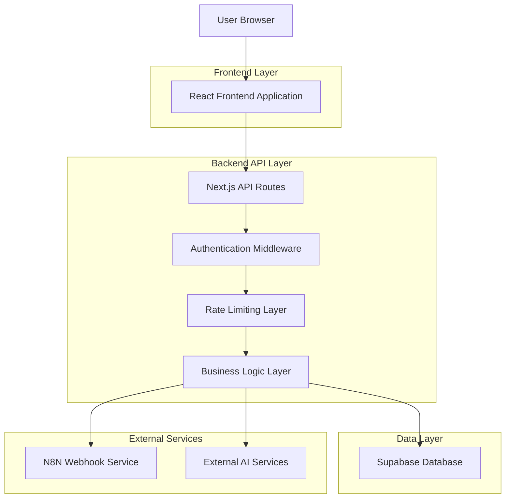
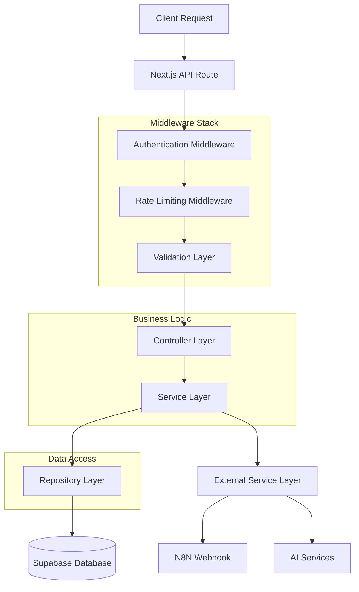
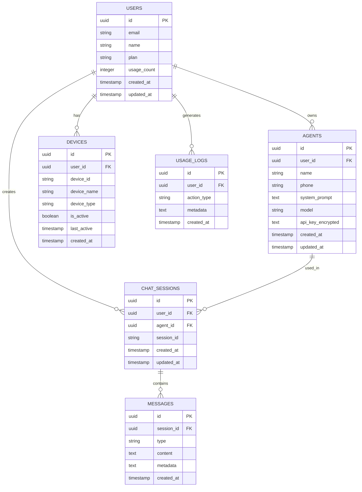

# AutoChat Security Architecture - Technical Architecture Document

## 1. Architecture Design



## 2. Technology Description

* **Frontend**: React\@18 + Next.js\@14 + TailwindCSS\@3 + TypeScript

* **Backend**: Next.js API Routes + Middleware

* **Database**: Supabase (PostgreSQL)

* **Authentication**: Supabase Auth + JWT

* **Rate Limiting**: Redis + upstash/ratelimit

* **Validation**: Zod for schema validation

* **Security**: bcrypt, helmet, cors

## 3. Route Definitions

| Route                     | Purpose                                          |
| ------------------------- | ------------------------------------------------ |
| /api/auth/session         | Validate user session and refresh tokens         |
| /api/chat/send            | Secure proxy untuk mengirim pesan ke N8N webhook |
| /api/chat/history         | Mengambil riwayat chat dengan pagination         |
| /api/agents               | CRUD operations untuk agent management           |
| /api/agents/\[id]         | Specific agent operations (GET, PUT, DELETE)     |
| /api/devices              | Device management dan registration               |
| /api/devices/\[id]/status | Update device status dengan authorization        |
| /api/usage/stats          | User usage statistics dan analytics              |
| /api/health               | Health check endpoint untuk monitoring           |

## 4. API Definitions

### 4.1 Core API

**Chat API - Send Message**

```
POST /api/chat/send
```

Request:

| Param Name | Param Type | isRequired | Description                           |
| ---------- | ---------- | ---------- | ------------------------------------- |
| message    | string     | true       | User message content (max 1000 chars) |
| agentId    | string     | true       | Selected agent ID                     |
| sessionId  | string     | true       | Chat session identifier               |

Headers:

| Header Name   | Description                    |
| ------------- | ------------------------------ |
| Authorization | Bearer JWT token from Supabase |
| Content-Type  | application/json               |

Response:

| Param Name     | Param Type | Description             |
| -------------- | ---------- | ----------------------- |
| success        | boolean    | Request status          |
| data           | object     | Response data           |
| data.response  | string     | AI assistant response   |
| data.messageId | string     | Unique message ID       |
| error          | string     | Error message if failed |

Example Request:

```json
{
  "message": "Hello, how can you help me?",
  "agentId": "agent_123",
  "sessionId": "session_456"
}
```

Example Response:

```json
{
  "success": true,
  "data": {
    "response": "Hello! I'm here to help you with any questions.",
    "messageId": "msg_789"
  }
}
```

**Agent Management API**

```
GET /api/agents
POST /api/agents
PUT /api/agents/[id]
DELETE /api/agents/[id]
```

POST Request:

| Param Name   | Param Type | isRequired | Description                             |
| ------------ | ---------- | ---------- | --------------------------------------- |
| name         | string     | true       | Agent name (max 100 chars)              |
| phone        | string     | false      | Phone number for WhatsApp integration   |
| systemPrompt | string     | false      | AI system prompt (max 2000 chars)       |
| model        | string     | false      | AI model selection                      |
| apiKey       | string     | false      | Encrypted API key for external services |

**Device Management API**

```
GET /api/devices
POST /api/devices/register
PUT /api/devices/[id]/status
DELETE /api/devices/[id]
```

## 5. Server Architecture Diagram



## 6. Data Model

### 6.1 Data Model Definition



### 6.2 Data Definition Language

**Enhanced Users Table**

```sql
-- Extend existing users table
ALTER TABLE users ADD COLUMN IF NOT EXISTS plan VARCHAR(20) DEFAULT 'free' CHECK (plan IN ('free', 'premium', 'enterprise'));
ALTER TABLE users ADD COLUMN IF NOT EXISTS usage_count INTEGER DEFAULT 0;
ALTER TABLE users ADD COLUMN IF NOT EXISTS daily_usage_count INTEGER DEFAULT 0;
ALTER TABLE users ADD COLUMN IF NOT EXISTS last_usage_reset DATE DEFAULT CURRENT_DATE;

-- Create index for performance
CREATE INDEX IF NOT EXISTS idx_users_plan ON users(plan);
CREATE INDEX IF NOT EXISTS idx_users_usage ON users(usage_count);
```

**Enhanced Agents Table**

```sql
-- Update agents table with security enhancements
ALTER TABLE agents ADD COLUMN IF NOT EXISTS api_key_encrypted TEXT;
ALTER TABLE agents ADD COLUMN IF NOT EXISTS is_active BOOLEAN DEFAULT true;
ALTER TABLE agents ADD COLUMN IF NOT EXISTS usage_count INTEGER DEFAULT 0;

-- Create indexes
CREATE INDEX IF NOT EXISTS idx_agents_user_id ON agents(user_id);
CREATE INDEX IF NOT EXISTS idx_agents_active ON agents(is_active);

-- Row Level Security
ALTER TABLE agents ENABLE ROW LEVEL SECURITY;

CREATE POLICY "Users can only access their own agents" ON agents
    FOR ALL USING (auth.uid() = user_id);
```

**Chat Sessions Table**

```sql
CREATE TABLE IF NOT EXISTS chat_sessions (
    id UUID PRIMARY KEY DEFAULT gen_random_uuid(),
    user_id UUID REFERENCES users(id) ON DELETE CASCADE,
    agent_id UUID REFERENCES agents(id) ON DELETE CASCADE,
    session_id VARCHAR(255) UNIQUE NOT NULL,
    metadata JSONB DEFAULT '{}',
    created_at TIMESTAMP WITH TIME ZONE DEFAULT NOW(),
    updated_at TIMESTAMP WITH TIME ZONE DEFAULT NOW()
);

-- Indexes
CREATE INDEX idx_chat_sessions_user_id ON chat_sessions(user_id);
CREATE INDEX idx_chat_sessions_session_id ON chat_sessions(session_id);
CREATE INDEX idx_chat_sessions_created_at ON chat_sessions(created_at DESC);

-- Row Level Security
ALTER TABLE chat_sessions ENABLE ROW LEVEL SECURITY;

CREATE POLICY "Users can only access their own chat sessions" ON chat_sessions
    FOR ALL USING (auth.uid() = user_id);
```

**Messages Table**

```sql
CREATE TABLE IF NOT EXISTS messages (
    id UUID PRIMARY KEY DEFAULT gen_random_uuid(),
    session_id UUID REFERENCES chat_sessions(id) ON DELETE CASCADE,
    type VARCHAR(20) NOT NULL CHECK (type IN ('user', 'assistant', 'system')),
    content TEXT NOT NULL,
    metadata JSONB DEFAULT '{}',
    created_at TIMESTAMP WITH TIME ZONE DEFAULT NOW()
);

-- Indexes
CREATE INDEX idx_messages_session_id ON messages(session_id);
CREATE INDEX idx_messages_created_at ON messages(created_at DESC);
CREATE INDEX idx_messages_type ON messages(type);

-- Row Level Security
ALTER TABLE messages ENABLE ROW LEVEL SECURITY;

CREATE POLICY "Users can only access messages from their own sessions" ON messages
    FOR ALL USING (
        session_id IN (
            SELECT id FROM chat_sessions WHERE user_id = auth.uid()
        )
    );
```

**Enhanced Device Table**

```sql
-- Update existing device table
ALTER TABLE device ADD COLUMN IF NOT EXISTS device_fingerprint VARCHAR(255);
ALTER TABLE device ADD COLUMN IF NOT EXISTS last_ip_address INET;
ALTER TABLE device ADD COLUMN IF NOT EXISTS user_agent TEXT;
ALTER TABLE device ADD COLUMN IF NOT EXISTS security_flags JSONB DEFAULT '{}';

-- Create indexes
CREATE INDEX IF NOT EXISTS idx_device_fingerprint ON device(device_fingerprint);
CREATE INDEX IF NOT EXISTS idx_device_last_active ON device(last_active DESC);

-- Row Level Security
ALTER TABLE device ENABLE ROW LEVEL SECURITY;

CREATE POLICY "Users can only access their own devices" ON device
    FOR ALL USING (auth.uid() = user_id);
```

**Usage Logs Table**

```sql
CREATE TABLE IF NOT EXISTS usage_logs (
    id UUID PRIMARY KEY DEFAULT gen_random_uuid(),
    user_id UUID REFERENCES users(id) ON DELETE CASCADE,
    action_type VARCHAR(50) NOT NULL,
    resource_type VARCHAR(50),
    resource_id UUID,
    ip_address INET,
    user_agent TEXT,
    metadata JSONB DEFAULT '{}',
    created_at TIMESTAMP WITH TIME ZONE DEFAULT NOW()
);

-- Indexes
CREATE INDEX idx_usage_logs_user_id ON usage_logs(user_id);
CREATE INDEX idx_usage_logs_action_type ON usage_logs(action_type);
CREATE INDEX idx_usage_logs_created_at ON usage_logs(created_at DESC);

-- Row Level Security
ALTER TABLE usage_logs ENABLE ROW LEVEL SECURITY;

CREATE POLICY "Users can only access their own usage logs" ON usage_logs
    FOR SELECT USING (auth.uid() = user_id);
```

**Rate Limiting Table**

```sql
CREATE TABLE IF NOT EXISTS rate_limits (
    id UUID PRIMARY KEY DEFAULT gen_random_uuid(),
    user_id UUID REFERENCES users(id) ON DELETE CASCADE,
    action_type VARCHAR(50) NOT NULL,
    count INTEGER DEFAULT 1,
    window_start TIMESTAMP WITH TIME ZONE DEFAULT NOW(),
    expires_at TIMESTAMP WITH TIME ZONE NOT NULL,
    created_at TIMESTAMP WITH TIME ZONE DEFAULT NOW()
);

-- Indexes
CREATE INDEX idx_rate_limits_user_action ON rate_limits(user_id, action_type);
CREATE INDEX idx_rate_limits_expires_at ON rate_limits(expires_at);

-- Auto cleanup expired entries
CREATE OR REPLACE FUNCTION cleanup_expired_rate_limits()
RETURNS void AS $$
BEGIN
    DELETE FROM rate_limits WHERE expires_at < NOW();
END;
$$ LANGUAGE plpgsql;
```

**Permissions Setup**

```sql
-- Grant permissions to authenticated users
GRANT SELECT, INSERT, UPDATE ON chat_sessions TO authenticated;
GRANT SELECT, INSERT ON messages TO authenticated;
GRANT SELECT, INSERT ON usage_logs TO authenticated;
GRANT SELECT, INSERT, UPDATE, DELETE ON rate_limits TO authenticated;

-- Grant basic read access to anon for public data
GRANT SELECT ON users TO anon;
```

