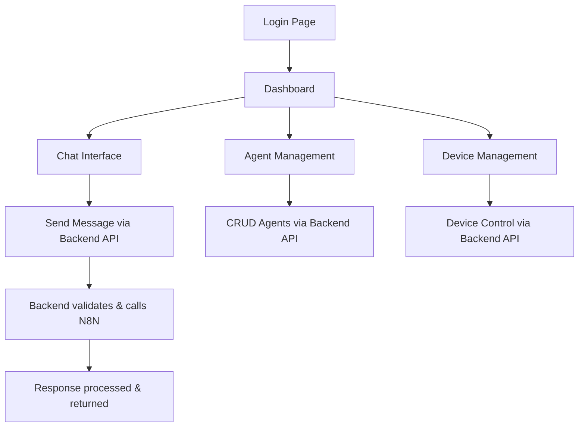

# AutoChat Security Enhancement - Product Requirements Document

## 1. Product Overview

AutoChat adalah aplikasi chat berbasis AI yang saat ini memiliki masalah keamanan kritis dimana frontend langsung berkomunikasi dengan service eksternal tanpa layer keamanan yang memadai. Proyek ini bertujuan untuk mengimplementasikan backend API yang aman sebagai bridge antara frontend dan service eksternal, menghilangkan eksposur API key dan sensitive data di client-side, serta menambahkan layer authentication, validation, dan rate limiting untuk production readiness.

## 2. Core Features

### 2.1 User Roles

| Role | Registration Method | Core Permissions |
|------|---------------------|------------------|
| Authenticated User | Supabase Authentication | Dapat menggunakan chat, mengelola agent, dan device management |
| Anonymous User | Tidak perlu registrasi | Akses terbatas hanya ke halaman publik |

### 2.2 Feature Module

Aplikasi AutoChat Security Enhancement terdiri dari halaman-halaman utama berikut:
1. **Chat Interface**: Interface chat yang aman dengan backend proxy, session management, rate limiting
2. **Agent Management**: Pengelolaan agent dengan API key yang aman, CRUD operations melalui backend
3. **Device Management**: Manajemen device dengan authentication yang proper, secure device registration
4. **Authentication Pages**: Login/register dengan Supabase integration yang aman
5. **Dashboard**: Overview penggunaan dengan metrics yang aman dari backend

### 2.3 Page Details

| Page Name | Module Name | Feature Description |
|-----------|-------------|---------------------|
| Chat Interface | Secure Chat Proxy | Mengirim pesan melalui backend API yang aman, tidak langsung ke N8N webhook. Termasuk session management, message validation, dan rate limiting per user |
| Chat Interface | Message History | Menyimpan dan menampilkan riwayat chat dengan encryption, pagination, dan filtering berdasarkan session |
| Agent Management | Agent CRUD | Create, read, update, delete agent melalui backend API dengan validation. API key disimpan aman di server, tidak terekspos ke frontend |
| Agent Management | Agent Configuration | Konfigurasi system prompt, model selection, dan phone number dengan validation dan sanitization |
| Device Management | Secure Device Registration | Registrasi device dengan proper authentication, device fingerprinting yang aman, dan rate limiting |
| Device Management | Device Status Control | Activate/deactivate device melalui backend API dengan proper authorization dan audit logging |
| Authentication | Supabase Integration | Login/logout dengan Supabase, session management, dan token refresh yang aman |
| Dashboard | Usage Analytics | Menampilkan statistik penggunaan dari backend API dengan proper data aggregation dan caching |

## 3. Core Process

### User Flow - Secure Chat Process
1. User login melalui Supabase authentication
2. Frontend mendapat JWT token yang valid
3. User memilih agent dari list yang dimuat melalui backend API
4. User mengirim pesan melalui chat interface
5. Frontend mengirim request ke backend API `/api/chat/send` dengan JWT token
6. Backend memvalidasi token, rate limiting, dan message content
7. Backend memanggil N8N webhook dengan API key yang aman
8. Backend menerima response dan menyimpan ke database
9. Backend mengirim response ke frontend dengan data yang sudah difilter
10. Frontend menampilkan response ke user

### Admin Flow - Agent Management
1. Authenticated user mengakses agent management
2. Frontend memuat list agent melalui `/api/agents` dengan authentication
3. User membuat/edit agent melalui form
4. Frontend mengirim data ke `/api/agents` dengan validation
5. Backend memvalidasi data dan menyimpan dengan encryption untuk sensitive data
6. Backend mengirim confirmation ke frontend

## 4. User Interface Design

### 4.1 Design Style

- **Primary Colors**: Blue (#3B82F6) untuk actions, Green (#10B981) untuk success states
- **Secondary Colors**: Gray (#6B7280) untuk text, Red (#EF4444) untuk errors
- **Button Style**: Rounded corners (8px), subtle shadows, hover states dengan opacity changes
- **Font**: Inter atau system fonts, 14px untuk body text, 16px untuk headings
- **Layout Style**: Card-based design dengan proper spacing, sidebar navigation untuk desktop
- **Icons**: Lucide React icons dengan consistent sizing (16px untuk inline, 20px untuk buttons)

### 4.2 Page Design Overview

| Page Name | Module Name | UI Elements |
|-----------|-------------|-------------|
| Chat Interface | Message Container | Scrollable message list dengan user/assistant message bubbles, timestamp, loading states untuk API calls |
| Chat Interface | Input Area | Text input dengan send button, character counter, disabled state saat loading, error states |
| Agent Management | Agent List | Table/card view dengan agent info, status badges, action buttons untuk edit/delete |
| Agent Management | Agent Form | Form fields untuk name, phone, system prompt, model selection dengan validation feedback |
| Device Management | Device Table | Responsive table dengan device info, status indicators, action dropdowns |
| Dashboard | Stats Cards | Metric cards dengan usage statistics, charts untuk trends, alert notifications |

### 4.3 Responsiveness

Aplikasi menggunakan mobile-first approach dengan breakpoints:
- Mobile: < 768px (stack layout, full-width components)
- Tablet: 768px - 1024px (adaptive sidebar, optimized touch targets)
- Desktop: > 1024px (full sidebar, multi-column layouts)

Touch interaction optimization untuk mobile devices dengan proper tap targets (minimum 44px) dan swipe gestures untuk navigation.